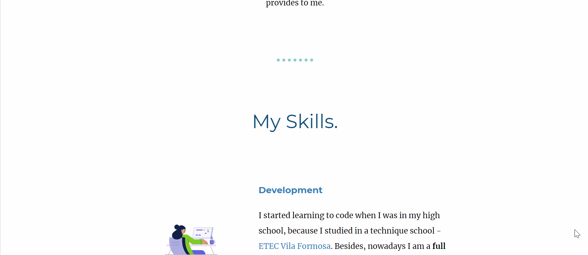

<h1 align="center">
   
  
   
   
  My Second Personal WebSite
</h1>

  This WebSite was created in order to practice my new skills, which I
  learning at the <a href="https://www.udemy.com/course/the-complete-web-development-bootcamp/?referralCode=F2958B9D9447BDFC8244" target="_blank">Web Development Bootcamp</a> during my vacation.

  
   
 
  

 
<h2>
  💻Technologies
</h2>

  This simple website was developed only using:

<ul>
  <li>HTML</li>
  <li>CSS</li>
</ul>
